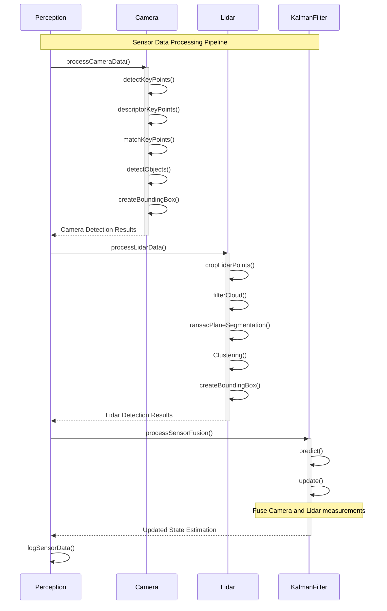

I'll create a sequence diagram showing the data flow and interactions between the Camera, Lidar, and KalmanFilter components based on the project structure.

This sequence diagram shows:

1. The main `Perception` class orchestrating the sensor fusion pipeline
2. Camera processing sequence including object detection and bounding box creation
3. Lidar processing sequence including point cloud processing and object clustering
4. KalmanFilter fusion of the sensor data to produce state estimates
5. Final logging of the processed data

The flow demonstrates how data moves from raw sensor inputs through processing stages to final fusion and logging.

[//]: # (This content was generated by AppMap Navie.)
[//]: # (messageId: 82e1c6a7-21cd-4fc8-ac3d-6a3f09566796)
[//]: # (threadId: e883e3aa-cbd7-4be4-881f-66542865a42d)
