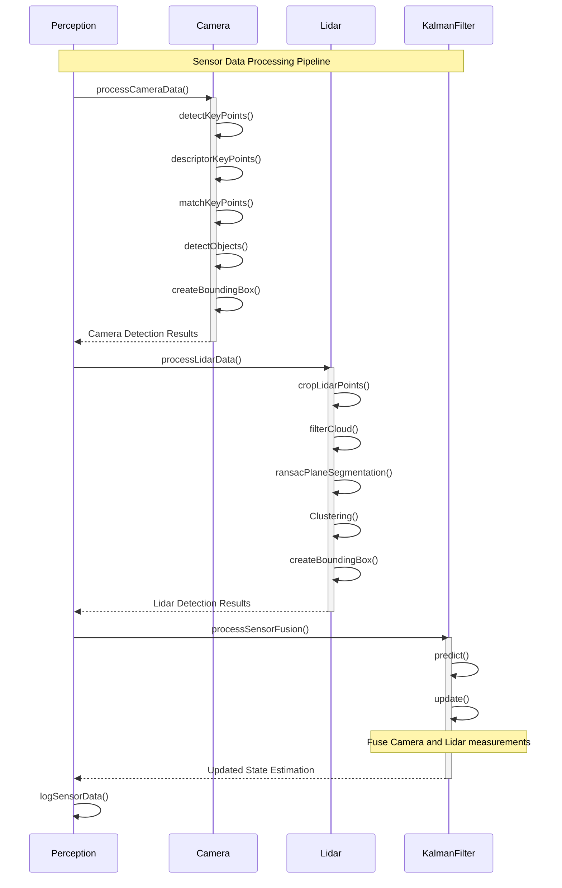

```mermaid
sequenceDiagram
    participant P as Perception
    participant C as Camera
    participant L as Lidar
    participant K as KalmanFilter

    Note over P,K: Sensor Data Processing Pipeline

    P->>C: processCameraData()
    activate C
    C->>C: detectKeyPoints()
    C->>C: descriptorKeyPoints()
    C->>C: matchKeyPoints()
    C->>C: detectObjects()
    C->>C: createBoundingBox()
    C-->>P: Camera Detection Results
    deactivate C

    P->>L: processLidarData()
    activate L
    L->>L: cropLidarPoints()
    L->>L: filterCloud()
    L->>L: ransacPlaneSegmentation()
    L->>L: Clustering()
    L->>L: createBoundingBox()
    L-->>P: Lidar Detection Results
    deactivate L

    P->>K: processSensorFusion()
    activate K
    K->>K: predict()
    K->>K: update()
    Note over K: Fuse Camera and Lidar measurements
    K-->>P: Updated State Estimation
    deactivate K

    P->>P: logSensorData()
```

[//]: # (This content was generated by AppMap Navie.)
[//]: # (messageId: 58caf56a-a172-487a-af65-4018be8b713e)
[//]: # (threadId: 05a48826-a16c-4161-9c83-8fd80a3cc826)
